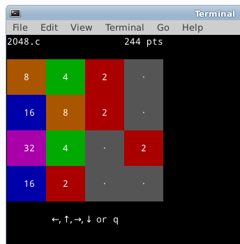

2048.c
======

[Spanish](README_es.md)



Console version of the game "2048" for GNU/Linux

### Gameplay

You can move the tiles in four directions using the arrow keys: up, down, left, and right. All numbers on the board will slide into that direction until they hit the wall and if they bump into each other then two numbers will be combined into one if they have the same value. Each number will only be combined once per move. Every move a new number 2 or 4 appears. If you have a 2048 on the board you have won, but you lose once the board is full and you cannot make a move. 

### Requirements

- C compiler

Tested on: GNU/Linux, FreeBSD, OpenBSD

### Installation

```
wget https://raw.githubusercontent.com/mevdschee/2048.c/master/2048.c
gcc -o 2048 2048.c
./2048
```

### Running

The game supports different color schemes. This depends on ANSI support for 88 or 256 colors. If there are not enough colors supported the game will fallback to black and white (still very much playable). For the original color scheme run:

```
./2048
```
For the black-to-white color scheme (requires 256 colors):

```
./2048 blackwhite
```

For the blue-to-red color scheme (requires 256 colors):

```
./2048 bluered
```

### Contributing

Contributions are very welcome. Always run the tests before committing using:

```
$ ./2048 test
All 13 tests executed successfully
```
